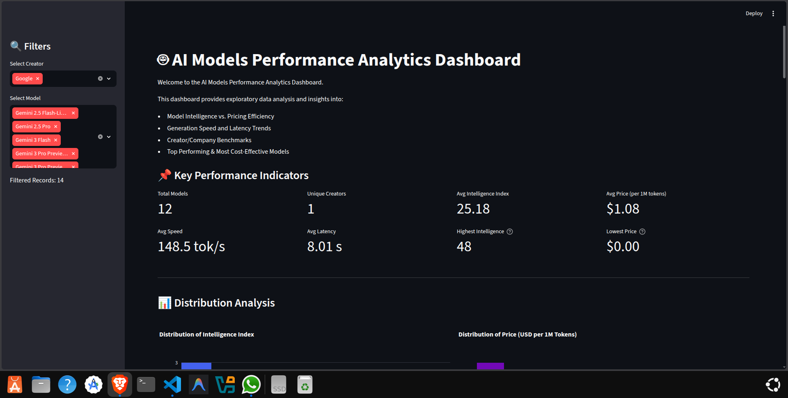
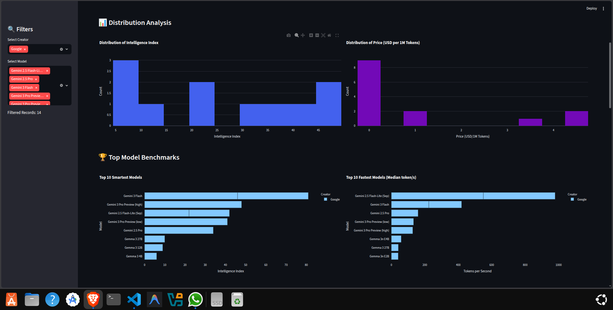
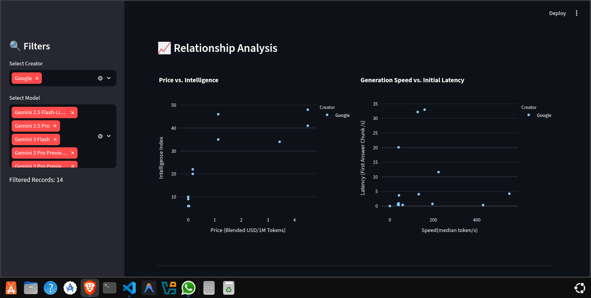
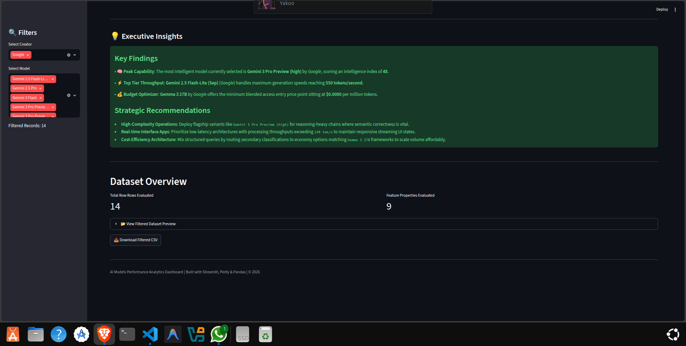

# 🤖 AI Models Performance EDA Dashboard



An interactive **Exploratory Data Analysis (EDA)** dashboard built using **Streamlit, Plotly, Pandas, Matplotlib, and Seaborn** to analyze and compare the performance of various Large Language Models (LLMs).

---

## 📌 Project Overview

This project performs an in-depth **Exploratory Data Analysis (EDA)** on a benchmark dataset of AI language models. It helps visualize and compare models based on key performance metrics such as intelligence, pricing, speed, latency, and context window.

The project includes:

- 📓 Comprehensive Jupyter Notebook for EDA
- 📊 Interactive Streamlit Dashboard
- 📈 Professional visualizations
- 📋 Statistical summaries and insights

---

# 📂 Project Structure

```
AI_MODELS_PERFORMANCE_EDA/
│
├── Data/
│   └── ai_models_performance.csv
│
├── Images/
│   ├── Analysis_Insights.png
│   ├── Dashboard_snapshots.png
│   ├── Distribution_analysis.png
│   └── Relationship Analysis.png
│
├── Notebooks/
│   └── ai_models_performance_eda.ipynb
│
├── main.py
├── requirements.txt
├── README.md
└── .gitignore
```

---

# 📊 Dataset Overview

The dataset contains benchmarking information for multiple AI models.

| Feature | Description |
|----------|-------------|
| Model | AI Model Name |
| Creator | Organization that developed the model |
| Context Window | Maximum supported context length |
| Intelligence Index | Overall intelligence score |
| Price (Blended USD/1M Tokens) | Cost per million tokens |
| Speed (median token/s) | Average token generation speed |
| Latency (First Answer Chunk /s) | Time taken to generate the first response |

---

# 📈 Exploratory Data Analysis

The notebook includes:

- Dataset Inspection
- Missing Value Analysis
- Duplicate Analysis
- Statistical Summary
- Distribution Analysis
- Boxplots
- Creator-wise Comparison
- Top 10 Intelligent Models
- Top 10 Fastest Models
- Cheapest Models
- Lowest Latency Models
- Scatter Plot Analysis
- Correlation Heatmap
- Interactive Visualizations

---

# 🖥️ Dashboard Features

The Streamlit dashboard provides:

- 📊 Interactive KPI Cards
- 📈 Distribution Analysis
- 📦 Boxplots
- 🏢 Creator-wise Analysis
- 🏆 Top 10 Intelligent Models
- ⚡ Top 10 Fastest Models
- 💰 Cheapest Models
- ⏱️ Lowest Latency Models
- 📉 Price vs Intelligence
- 🚀 Speed vs Intelligence
- ⌛ Speed vs Latency
- 🔥 Correlation Heatmap
- 📋 Dataset Viewer
- 📥 Download Filtered Dataset

---

# 📷 Dashboard Preview

## 🏠 Main Dashboard


---

## 📊 Distribution Analysis



---

## 📈 Relationship Analysis



---

## 💡 Key Insights



---

# 🛠️ Tech Stack

- Python
- Streamlit
- Pandas
- NumPy
- Plotly
- Matplotlib
- Seaborn

---

# 🚀 Installation

Clone the repository

```bash
git clone https://github.com/your-username/AI_MODELS_PERFORMANCE_EDA.git
```

Move to the project directory

```bash
cd AI_MODELS_PERFORMANCE_EDA
```

Create a virtual environment

```bash
python -m venv venv
```

Activate the environment

### Windows

```bash
venv\Scripts\activate
```

### Linux/macOS

```bash
source venv/bin/activate
```

Install dependencies

```bash
pip install -r requirements.txt
```

---

# ▶️ Run the Dashboard

```bash
streamlit run main.py
```

The dashboard will automatically open in your default web browser.

---

# 📌 Key Insights

- Compare AI models using intelligence, speed, price, and latency.
- Identify the fastest and most intelligent models.
- Analyze pricing trends across creators.
- Explore relationships between cost and performance.
- Understand creator-wise performance distributions.
- Download filtered datasets directly from the dashboard.

---

# 📚 Learning Outcomes

This project demonstrates:

- Exploratory Data Analysis (EDA)
- Data Cleaning & Preprocessing
- Statistical Analysis
- Data Visualization
- Interactive Dashboard Development
- Streamlit Application Development
- Correlation Analysis
- Performance Benchmarking

---

# 🔮 Future Enhancements

- 🤖 AI Model Recommendation System
- 📈 Predictive Analytics
- 🌙 Dark Mode
- ☁️ Streamlit Cloud Deployment
- 🔎 Advanced Filtering Options
- 📊 Real-time Benchmark Updates

---

# 👨‍💻 Author

**Prashanth J N**

**Computer Science & Engineering (Data Science)**

Alva's Institute of Engineering & Technology

📧 Email: *prashi8711@gmail.com*

---

## ⭐ If you found this project useful, don't forget to star the repository!